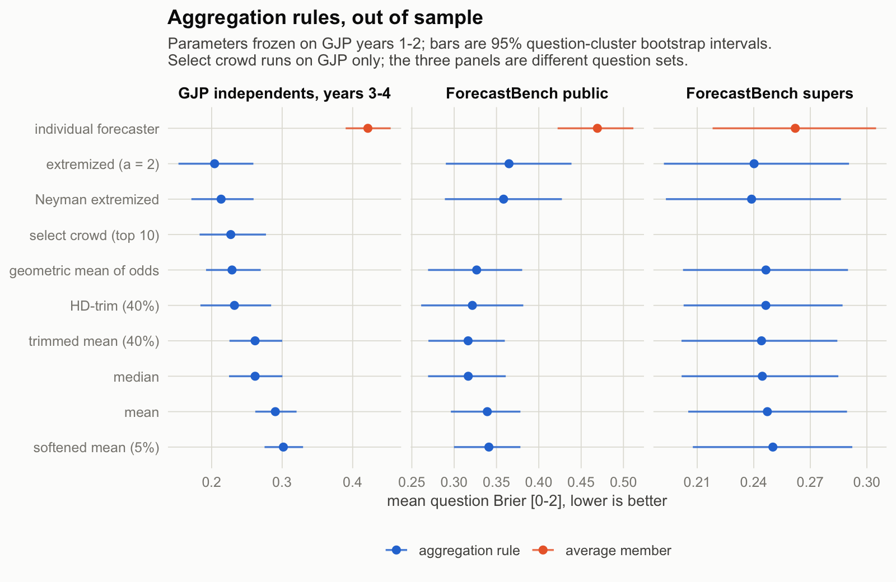

# crowd-forecast-evaluation

How much better is a crowd of forecasters than its members, and which way of
combining their probabilities holds up out of sample?

This project scores and aggregates human probability forecasts from two public
corpora:

- **Good Judgment Project (ACE tournament, 2011–2015)** — individual-level survey
  forecasts from a four-year geopolitical forecasting tournament.
  Harvard Dataverse, [doi:10.7910/DVN/BPCDH5](https://doi.org/10.7910/DVN/BPCDH5),
  CC0 1.0.
- **ForecastBench (2024 human round)** — individual forecasts from the benchmark's
  public and superforecaster comparison groups.
  [forecastingresearch/forecastbench-datasets](https://github.com/forecastingresearch/forecastbench-datasets),
  CC BY-SA 4.0.

**The write-up is [analysis/manuscript.pdf](analysis/manuscript.pdf)**: data,
both scoring protocols, the tuning and evaluation split, the results, and the
limitations. Every figure and table in it is computed from the database when
it renders.

Three findings. Aggregating is worth more than choosing how to aggregate: on
the held-out GJP years the best rule scores 0.204 against 0.422 for the
average member of the same crowd on the same days, and even a plain mean
captures most of that gap. Extremizing the pooled log odds wins there, and
keeps improving as the crowd grows past the point where the simple mean
saturates. And the constant does not travel: it is seventh of eight on
ForecastBench's public crowd, which is already overconfident where the GJP
independents are underconfident.



## Reproducing

Everything runs locally in R against a DuckDB database built from the raw files.

```
make setup        # once per clone: install the locked dependencies (renv)
make fetch        # verify raw data files (prints download instructions if missing)
make data         # build the DuckDB analysis schema from raw files
make fb           # add the ForecastBench per-horizon scoring layer
make scores       # apply the GJP daily carry-forward scoring protocol
make experiments  # tune, freeze, and run the aggregation horse race
make qa           # run the QA gate and write qa/qa_report.md
make test         # unit tests; writes qa/test-summary.csv
make analyze      # render the notebooks and the manuscript (requires Quarto)
```

`make all` is the whole chain except the render. `make manuscript` renders the
paper alone, against whatever the last `make experiments` produced.

Harvard Dataverse sits behind a browser-verification wall, so the raw GJP files
cannot be fetched by script. `make fetch` prints per-file instructions; download
the files in a browser from the dataset page and place them in `data/raw/`.
Every file is then verified against `data/manifest.csv` (size and MD5) before
anything downstream will run. No raw data is committed to this repository.

## Layout

```
R/          functions: fetch verification, ingest, scoring protocol,
            aggregation rules, experiment harness, QA, figure style
scripts/    pipeline entry points, run via make
analysis/   the manuscript, two Quarto notebooks, generated figures and results
tests/      testthat unit tests (synthetic fixtures; no raw data required)
data/       manifest.csv (committed); raw/ and db/ (local only, gitignored)
docs/       data notes
qa/         generated QA reports (committed)
```

Three documents, with different jobs. The **manuscript** is the account of
what was measured and what it means, and is the canonical statement of both
scoring protocols. The two **notebooks** are the working analyses it draws
on — [scoring-calibration.qmd](analysis/scoring-calibration.qmd) for
individual accuracy and calibration,
[aggregation.qmd](analysis/aggregation.qmd) for the horse race — and carry
more detail than the paper has room for.
[docs/data-notes.md](docs/data-notes.md) is the build-level reference: source
schemas, file-format quirks, the experimental-condition structure of the GJP
tournament, exclusion rules, and the DuckDB tables each `make` target
produces.

## Data, licensing, and attribution

The code in this repository is MIT-licensed (see [LICENSE](LICENSE)). The two
corpora keep their own terms and are not redistributed here:

- The Good Judgment Project ACE data is released under CC0 1.0. Cite as: Good
  Judgment Project, 2016, "GJP Data", Harvard Dataverse, V1,
  [doi:10.7910/DVN/BPCDH5](https://doi.org/10.7910/DVN/BPCDH5).
- The ForecastBench datasets are released under
  [CC BY-SA 4.0](https://creativecommons.org/licenses/by-sa/4.0/) by the
  Forecasting Research Institute, and are used here at pinned commit
  `0b82035`. The benchmark is described in Karger et al. (2025),
  "ForecastBench: A Dynamic Benchmark of AI Forecasting Capabilities", ICLR
  2025.

Three of the nine aggregation rules delegate to
[aggutils](https://CRAN.R-project.org/package=aggutils) (MIT), the reference
implementation of the trimming and extremizing methods; the other six are
implemented here. Unit tests cross-check the two against each other on every
rule they share. Full references are in
[analysis/references.bib](analysis/references.bib).
